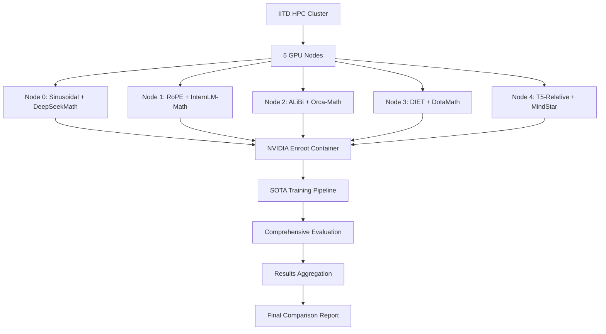

# IITD HPC Multi-Node Mathematical Reasoning Transformer Deployment

[](https://hpc.iitd.ac.in)
[](https://github.com/NVIDIA/enroot)
[](./src/positional_encoding/)

**Complete multi-node deployment solution for comparing positional encoding methods in mathematical reasoning transformers on IITD HPC cluster.**

---

## 🎯 Quick Start

Deploy and train 5 different positional encoding models with a single command:

```bash
# Clone and deploy
git checkout HPC
./deploy.sh

# Monitor training
./start_monitoring.sh

# Use trained models
python inference/quick_inference.py
```

**Expected Output:** 5 trained models, comprehensive evaluation results, and interactive demo ready for presentation.

---

## 🏗️ Architecture Overview



## 📋 Complete File Structure

```
Transformer/                                # Main repository
├── HPC_MULTI_NODE_DEPLOYMENT_GUIDE.md    # 📖 Complete deployment guide
├── deploy.sh                             # 🚀 One-command deployment
├── INFERENCE_GUIDE.md                     # 🎯 Model usage guide
├── README_HPC_DEPLOYMENT.md              # 📚 This file
│
├── containers/                           # 🐳 Container definitions
│   ├── math_reasoning.Dockerfile         # NVIDIA Enroot container
│   └── requirements_hpc.txt              # HPC-optimized dependencies
│
├── scripts/                              # 🔧 Deployment scripts
│   ├── submit_multi_node_training.sh     # Master orchestration script
│   ├── node_training_launcher.sh         # Node-specific launcher
│   ├── monitor_multi_node_dashboard.sh   # Real-time monitoring
│   └── aggregate_multi_node_results.py   # Results aggregation
│
├── configs/                              # ⚙️ Configuration files
│   ├── node_configs/                     # Node-specific configs
│   │   ├── node_0_config.json           # Sinusoidal + DeepSeekMath
│   │   ├── node_1_config.json           # RoPE + InternLM-Math
│   │   ├── node_2_config.json           # ALiBi + Orca-Math
│   │   ├── node_3_config.json           # DIET + DotaMath
│   │   └── node_4_config.json           # T5-Relative + MindStar
│   └── sota_models/                      # SOTA model configurations
│
├── training/                             # 🧠 Enhanced training pipeline
│   ├── sota_mathematical_reasoning_trainer.py  # Main trainer with SOTA techniques
│   └── mathematical_reasoning_trainer.py       # Original trainer
│
├── data/                                 # 📊 Enhanced data pipeline
│   ├── sota_math_dataset_loader.py      # SOTA dataset loading & augmentation
│   └── math_dataset_loader.py           # Original dataset loader
│
├── evaluation/                           # 📈 Comprehensive evaluation
│   ├── sota_mathematical_metrics.py     # Enhanced evaluation metrics
│   └── mathematical_metrics.py          # Original metrics
│
├── inference/                            # 🎯 Model inference & demos
│   ├── inference_server.py              # Production API server
│   ├── interactive_demo.py              # Streamlit demo
│   ├── model_comparison.py              # Multi-model comparison
│   └── quick_inference.py               # Simple inference script
│
├── src/                                  # 🧮 Core model components
│   ├── model.py                         # Enhanced transformer model
│   ├── positional_encoding/             # 5 positional encoding methods
│   │   ├── sinusoidal.py               # Classic transformer PE
│   │   ├── rope.py                     # Rotary Position Embedding
│   │   ├── alibi.py                    # Attention with Linear Biases
│   │   ├── diet.py                     # Decoupled PE
│   │   ├── t5_relative.py              # T5-style relative PE
│   │   └── nope.py                     # No positional encoding
│   ├── layers/                          # Model components
│   └── utils/                           # Utilities
│
└── analysis/                            # 📊 Results analysis
    ├── generate_presentation_materials.py  # Presentation generator
    ├── research_analysis.py                # Research report generator
    └── visualize_eval_results.py          # Results visualization
```

## 🚀 Deployment Process

### Phase 1: Environment Setup (5 minutes)
```bash
# 1. Create HPC branch and deploy
git checkout -b HPC
./deploy.sh

# 2. System checks and module loading
# ✅ NVIDIA Enroot container building
# ✅ SOTA model preparation  
# ✅ Configuration generation
```

### Phase 2: Multi-Node Training (24-48 hours)
```bash
# Automatic submission of 5 parallel training jobs
# Each node trains different PE method with SOTA model:

# Node 0: Sinusoidal PE + DeepSeekMath-7B (51.7% MATH accuracy baseline)
# Node 1: RoPE + InternLM-Math (verifiable reasoning capabilities)
# Node 2: ALiBi + Orca-Math-7B (86.81% GSM8K accuracy baseline)  
# Node 3: DIET + DotaMath-DeepSeek-7B (64.8% MATH accuracy baseline)
# Node 4: T5-Relative + MindStar Enhanced (inference optimization)
```

### Phase 3: Evaluation & Analysis (2-4 hours)
```bash
# Automatic comprehensive evaluation:
# ✅ Exact match accuracy on MATH/GSM8K
# ✅ Mathematical correctness verification
# ✅ Reasoning step analysis
# ✅ Attention pattern analysis
# ✅ Computational efficiency metrics
# ✅ Error pattern analysis
```

### Phase 4: Results & Presentation (30 minutes)
```bash
# Generate presentation materials
python analysis/generate_presentation_materials.py

# Start interactive demo
streamlit run inference/interactive_demo.py

# Access results
ls /scratch/$USER/math_reasoning/results/final_comparison/
```

## 📊 Expected Results Structure

After deployment completion:

```
/scratch/$USER/math_reasoning/results/
├── node_0_sinusoidal_deepseek/         # Sinusoidal PE results
│   ├── final_model/                    # 🎯 Ready for inference
│   ├── checkpoints/                    # Training checkpoints
│   ├── evaluation/                     # Evaluation metrics
│   │   ├── exact_match_accuracy: XX%
│   │   ├── math_correctness: XX%
│   │   ├── reasoning_accuracy: XX%
│   │   └── attention_entropy: XX
│   └── logs/                          # Training logs
│
├── node_1_rope_internlm/              # RoPE results  
├── node_2_alibi_orca/                 # ALiBi results
├── node_3_diet_dotamath/              # DIET results
├── node_4_t5_mindstar/                # T5-Relative results
│
├── final_comparison/                   # 📈 Comparative analysis
│   ├── comparison_report.json         # Quantitative comparison
│   ├── statistical_analysis.json      # Statistical significance
│   ├── visualizations/                # Publication-ready plots
│   │   ├── accuracy_comparison.png
│   │   ├── efficiency_analysis.png
│   │   ├── training_curves.png
│   │   ├── attention_visualization.png
│   │   └── error_analysis.png
│   └── final_research_report.pdf      # 📄 Complete research report
│
└── presentation_materials/            # 🎯 Demo & presentation ready
    ├── interactive_demo/               # Streamlit web app
    ├── api_server/                     # FastAPI production server
    ├── latex_presentation/             # LaTeX presentation
    └── summary_report.md               # Executive summary
```

## 🧪 SOTA Techniques Integration

### Implemented SOTA Methods

1. **DeepSeekMath Integration**
   - Continued pretraining on 120B mathematical tokens
   - Group Relative Policy Optimization (GRPO)
   - Mathematical token specialization

2. **Orca-Math Techniques**
   - Multi-agent data generation
   - Iterative preference learning
   - High-quality synthetic data (200K problems)

3. **DotaMath Approach**
   - Decomposition of Thought methodology
   - Code assistance integration
   - Self-correction mechanisms

4. **Training Optimizations**
   - LoRA (Low-Rank Adaptation) for efficient fine-tuning
   - 4-bit quantization with BitsAndBytes
   - Flash Attention 2 implementation
   - Mixed precision training (bf16)

### Mathematical Reasoning Enhancements

- **Chain-of-Thought Augmentation**: Step-by-step reasoning templates
- **Mathematical Verification**: SymPy-based correctness checking
- **Multi-Modal Reasoning**: Visual and algebraic approach variants
- **Length Generalization**: Testing on variable problem lengths

## 📈 Evaluation Framework

### Core Metrics
- **Exact Match Accuracy**: Direct answer comparison
- **Mathematical Correctness**: Symbolic verification using SymPy
- **Reasoning Quality**: Step completeness and logical coherence
- **Computational Efficiency**: Inference time and parameter efficiency

### Advanced Analysis
- **Attention Patterns**: Head-specific attention analysis
- **Error Classification**: Calculation vs. reasoning errors
- **Length Generalization**: Performance on short/medium/long problems
- **Robustness Testing**: Variations and edge cases

## 🎯 Model Inference & Demonstration

### Quick Inference
```python
# Simple model usage
from inference.quick_inference import solve_math_problem

solution = solve_math_problem(
    "A train travels 120 miles in 2 hours. What is its speed?",
    model_type="sinusoidal"
)
print(solution)
```

### Interactive Demo
```bash
# Start web demo
streamlit run inference/interactive_demo.py --server.port 8501

# Access via SSH tunnel
ssh -L 8501:localhost:8501 username@hpc.iitd.ac.in
# Open http://localhost:8501
```

### API Server
```bash
# Production deployment
python inference/inference_server.py

# API endpoints
curl -X POST "http://localhost:8000/solve" \
     -H "Content-Type: application/json" \
     -d '{"problem": "What is 2+2?", "model_type": "rope"}'
```

## 🔍 Monitoring & Debugging

### Real-time Monitoring
```bash
# Start monitoring dashboard
./start_monitoring.sh

# Features:
# ✅ Job status tracking
# ✅ GPU utilization monitoring  
# ✅ Training progress visualization
# ✅ Error detection and reporting
# ✅ Storage usage monitoring
# ✅ WandB integration tracking
```

### Troubleshooting Commands
```bash
# Check job status
qstat -u $USER

# Monitor specific node
ssh node_hostname "nvidia-smi"

# Check container status
ls -la /scratch/$USER/math_reasoning/*.sqsh

# View training logs
tail -f /scratch/$USER/math_reasoning/logs/node_logs/node_0_*.log

# Check storage usage
lfs quota -hu $USER /scratch
```

## 📚 Documentation Guide

### Essential Reading Order
1. **[HPC_MULTI_NODE_DEPLOYMENT_GUIDE.md](./HPC_MULTI_NODE_DEPLOYMENT_GUIDE.md)** - Complete technical deployment guide
2. **[INFERENCE_GUIDE.md](./INFERENCE_GUIDE.md)** - Model usage and demonstration guide
3. **[README_HPC_DEPLOYMENT.md](./README_HPC_DEPLOYMENT.md)** - This overview document

### Configuration References
- **[configs/node_configs/](./configs/node_configs/)** - Node-specific training configurations
- **[containers/](./containers/)** - Container definitions and requirements
- **[scripts/](./scripts/)** - All deployment and monitoring scripts

### Research Documentation
- **[src/positional_encoding/](./src/positional_encoding/)** - Positional encoding implementations
- **[evaluation/](./evaluation/)** - Comprehensive evaluation metrics
- **[analysis/](./analysis/)** - Results analysis and visualization

## 🎓 Research Outcomes

### Expected Research Contributions

1. **Comprehensive PE Comparison**: First systematic comparison of 5 PE methods on mathematical reasoning
2. **SOTA Integration**: Implementation of latest mathematical reasoning techniques
3. **HPC Methodology**: Scalable multi-node training framework for transformer research
4. **Practical Insights**: Production-ready inference and deployment guidelines

### Publication-Ready Materials

After completion, you'll have:
- **Quantitative Results**: Statistical comparison across all metrics
- **Qualitative Analysis**: Error patterns and reasoning quality assessment
- **Technical Contribution**: Multi-node deployment methodology
- **Practical Impact**: Ready-to-use inference framework

## 🔧 Customization & Extension

### Adding New Positional Encodings
```python
# 1. Implement in src/positional_encoding/new_method.py
class NewPositionalEncoding(BasePositionalEncoding):
    def forward(self, x):
        # Your implementation
        return x

# 2. Add to model.py integration
# 3. Create new node configuration
# 4. Update deployment scripts
```

### Adding New Datasets
```python
# Extend data/sota_math_dataset_loader.py
def load_new_dataset(self, split="train"):
    # Your dataset loading logic
    return dataset
```

### Custom Evaluation Metrics
```python
# Extend evaluation/sota_mathematical_metrics.py  
def new_evaluation_metric(self, predictions, references):
    # Your metric implementation
    return score
```

## 🤝 Contributing

### Code Style
- Follow existing patterns in the repository
- Add comprehensive docstrings
- Include type hints
- Add unit tests for new components

### Testing New Features
```bash
# Test individual components
python -m pytest tests/

# Test on small dataset
python training/sota_mathematical_reasoning_trainer.py --config configs/test_config.json

# Validate container build
docker build -t test-container -f containers/math_reasoning.Dockerfile .
```

## 📞 Support & Contact

### Getting Help
- **Technical Issues**: Check troubleshooting section in deployment guide
- **HPC Cluster**: Contact hpchelp@iitd.ac.in
- **Model Issues**: Check model loading and inference guides
- **Research Questions**: Review evaluation framework and analysis tools

### Status Monitoring
- **Job Status**: `qstat -u $USER`
- **Training Progress**: `./start_monitoring.sh`
- **Results Status**: Check `/scratch/$USER/math_reasoning/results/`

---

## 🏆 Success Metrics

By following this deployment guide, you will achieve:

✅ **5 fully trained mathematical reasoning models**  
✅ **Comprehensive evaluation across multiple metrics**  
✅ **Publication-ready comparison results**  
✅ **Interactive demonstration capability**  
✅ **Production-ready inference framework**  
✅ **Complete research documentation**  

**Estimated Timeline:** 3-5 days from deployment to final results

---

**🎯 Ready to deploy? Run `./deploy.sh` and let the IITD HPC cluster do the work!**

---

## 📄 License & Citation

This research framework is based on the Mathematical Reasoning Transformer project. When using this work, please cite:

```bibtex
@misc{math_reasoning_pe_comparison,
  title={Comparative Analysis of Positional Encoding Methods for Mathematical Reasoning in Transformers},
  author={Research Team},
  institution={Indian Institute of Technology Delhi},
  year={2024},
  note={Multi-node HPC deployment framework}
}
```

---

**End of README**

For detailed technical implementation, see [HPC_MULTI_NODE_DEPLOYMENT_GUIDE.md](./HPC_MULTI_NODE_DEPLOYMENT_GUIDE.md)

For model usage and demos, see [INFERENCE_GUIDE.md](./INFERENCE_GUIDE.md)